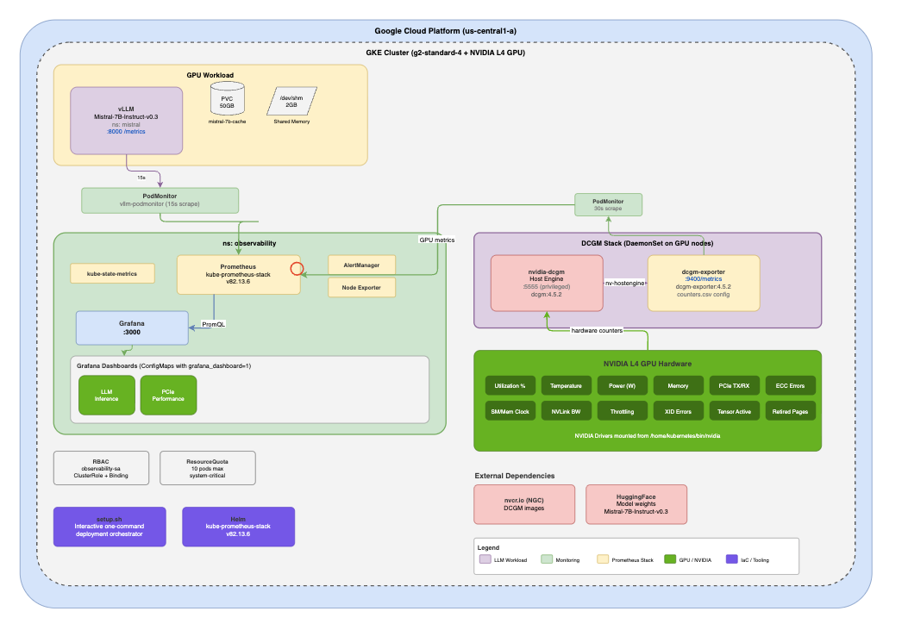

# GPU Observability on GKE with Mistral 7B

Deploy **Mistral 7B** on Google Kubernetes Engine with full GPU observability using **DCGM Exporter**, **Prometheus**, and **Grafana**. This guide walks you through creating a GKE cluster with NVIDIA L4 GPUs, deploying an LLM inference workload with vLLM, and setting up a complete monitoring stack to observe GPU utilization, memory, temperature, power, and inference performance in real time.

| | |
|---|---|
| **Duration** | ~45 minutes |
| **GPU** | NVIDIA L4 (g2-standard-4) |
| **Model** | Mistral-7B-Instruct-v0.3 |
| **Runtime** | vLLM (OpenAI-compatible API) |
| **Monitoring** | Prometheus + Grafana + DCGM Exporter |

---

## What you will learn

1. Create a GKE cluster with a GPU node pool
2. Deploy **Mistral 7B** using vLLM with chunked prefill for efficient inference
3. Set up NVIDIA DCGM Exporter to collect 40+ GPU metrics
4. Install Prometheus and Grafana via the `kube-prometheus-stack` Helm chart
5. Configure PodMonitors to scrape both GPU and LLM inference metrics
6. Visualize GPU health and inference performance in pre-built Grafana dashboards
7. Query the model through its OpenAI-compatible API

---

## Architecture



---

## 1. Prerequisites

Before you begin, make sure you have the following installed and configured:

- [ ] **Google Cloud SDK** (`gcloud`) — [Install guide](https://cloud.google.com/sdk/docs/install)
- [ ] **kubectl** — [Install guide](https://kubernetes.io/docs/tasks/tools/)
- [ ] **Helm 3.x** — [Install guide](https://helm.sh/docs/intro/install/)
- [ ] **A Google Cloud project** with billing enabled
- [ ] **A Hugging Face token** — [Create one here](https://huggingface.co/settings/tokens) (requires accepting the [Mistral 7B license](https://huggingface.co/mistralai/Mistral-7B-Instruct-v0.3))

Install the GKE auth plugin if you haven't already:

```bash
gcloud components install gke-gcloud-auth-plugin
```

---

## 2. Set environment variables

Open **Cloud Shell** or your local terminal and set the following variables. Update the values to match your project:

```bash
export PROJECT_ID=<your-gcp-project-id>
export ZONE=us-central1-a
export CLUSTER_NAME=gpu-observability
export GPU_TYPE=nvidia-l4
export GPU_COUNT=1
export MACHINE_TYPE=g2-standard-4
export HF_TOKEN=<your-huggingface-token>
```

> **Note:** The `g2-standard-4` machine type comes with 1 NVIDIA L4 GPU (24 GB VRAM), which is sufficient for Mistral 7B inference.

---

## 3. Create a GKE cluster with GPU nodes

Create a GKE cluster with a GPU-enabled node pool. To deploy your own DCGM exporter with the full set of GPU metrics, pass `--monitoring=SYSTEM` to disable the default GKE-managed DCGM:

```bash
gcloud container clusters create ${CLUSTER_NAME} \
    --project=${PROJECT_ID} \
    --zone=${ZONE} \
    --accelerator type=${GPU_TYPE},count=${GPU_COUNT},gpu-driver-version=latest \
    --machine-type=${MACHINE_TYPE} \
    --num-nodes=1 \
    --monitoring=SYSTEM
```

This creates a single-node cluster with an NVIDIA L4 GPU and the latest GPU drivers automatically installed.

Fetch your cluster credentials:

```bash
gcloud container clusters get-credentials ${CLUSTER_NAME} \
    --zone=${ZONE} \
    --project=${PROJECT_ID}
```

Verify the GPU node is ready:

```bash
kubectl get nodes -o wide
kubectl describe nodes -l cloud.google.com/gke-accelerator
```

You should see `nvidia.com/gpu: 1` in the node's allocatable resources.

---

## 4. Deploy the observability namespace and RBAC

Create the `observability` namespace, service account, and RBAC rules that allow Prometheus to scrape metrics across the cluster:

```bash
kubectl apply -f monitoring/namespace.yaml
```

This creates:
- **Namespace:** `observability`
- **ServiceAccount:** `observability-sa`
- **ClusterRole:** Permissions to read nodes, pods, endpoints, services, and metrics
- **ClusterRoleBinding:** Binds the role to the service account

---

## 5. Install Prometheus and Grafana

Add the Prometheus community Helm repo and install the `kube-prometheus-stack`:

```bash
helm repo add prometheus-community https://prometheus-community.github.io/helm-charts
helm repo update
```

```bash
helm install kube-prometheus-stack prometheus-community/kube-prometheus-stack \
    --version 82.13.6 \
    --namespace observability \
    --set prometheus.prometheusSpec.serviceMonitorSelectorNilUsesHelmValues=false \
    --set prometheus.prometheusSpec.podMonitorSelectorNilUsesHelmValues=false
```

> **Important:** The `--set` flags ensure Prometheus picks up **all** PodMonitors and ServiceMonitors across the cluster, not just those created by the Helm chart.

Verify the stack is running:

```bash
kubectl get pods -n observability
```

Wait until all pods show `Running` or `Completed`.

---

## 6. Deploy DCGM Exporter for GPU metrics

NVIDIA Data Center GPU Manager (DCGM) Exporter collects detailed GPU telemetry. This project uses a **two-DaemonSet pattern** split across separate manifests for clarity:

| File | Component | Description |
|---|---|---|
| `dcgm.yaml` | **DCGM Host Engine** | Runs `nv-hostengine` on each GPU node (port 5555) |
| `exporter.yaml` | **DCGM Exporter** | Connects to the host engine and exposes Prometheus metrics (port 9400) |
| `configmap.yaml` | **Metrics Config** | Defines 40+ DCGM fields to export as a CSV |
| `podmonitor.yaml` | **PodMonitor** | Tells Prometheus to scrape the exporter every 30s |

### Deploy the metrics ConfigMap

First, deploy the ConfigMap that defines which GPU metrics to collect:

```bash
kubectl apply -f monitoring/dcgm/configmap.yaml
```

This configures 40+ metrics across these categories:

| Category | Metrics |
|---|---|
| **Utilization** | GPU utilization %, memory copy utilization |
| **Temperature** | GPU temp, memory temp |
| **Power** | Power draw (W), total energy consumption |
| **Memory** | Framebuffer used/free/total (MiB) |
| **PCIe** | TX/RX throughput, replay counter, link gen/width |
| **Errors** | XID errors, ECC errors, throttling violations |
| **Profiling** | Tensor/FP16/FP32/FP64 core activity, DRAM activity |

### Deploy the DCGM host engine

The host engine DaemonSet runs a privileged container on every GPU node to communicate with the NVIDIA driver:

```bash
kubectl apply -f monitoring/dcgm/dcgm.yaml
```

### Deploy the DCGM exporter

The exporter DaemonSet connects to the host engine and serves metrics at `/metrics` on port 9400:

```bash
kubectl apply -f monitoring/dcgm/exporter.yaml
```

### Create the PodMonitor

Create the PodMonitor so Prometheus scrapes DCGM metrics every 30 seconds:

```bash
kubectl apply -f monitoring/dcgm/podmonitor.yaml
```

> **Tip:** You can also deploy all four manifests at once:
> ```bash
> kubectl apply -f monitoring/dcgm/
> ```

### Verify DCGM is running

```bash
kubectl get pods -n observability -l app=nvidia-dcgm
kubectl get pods -n observability -l app.kubernetes.io/name=nvidia-dcgm-exporter
```

Spot-check raw GPU metrics:

```bash
kubectl port-forward -n observability \
  $(kubectl get pod -n observability -l app.kubernetes.io/name=nvidia-dcgm-exporter -o jsonpath='{.items[0].metadata.name}') \
  9400:9400 &

curl -s localhost:9400/metrics | grep DCGM_FI_DEV_GPU_UTIL
```

---

## 7. Deploy Mistral 7B with vLLM

### Create the namespace and secret

```bash
kubectl create namespace mistral
```

Create a Kubernetes secret with your Hugging Face token so vLLM can download the model:

```bash
kubectl create secret generic hf-token-secret \
    --from-literal=token=${HF_TOKEN} \
    -n mistral
```

### Create the PersistentVolumeClaim

The model weights are cached on a 50 Gi persistent disk so subsequent pod restarts don't re-download:

```bash
kubectl apply -f workloads/vllm/mistral/pvc.yaml
```

### Deploy the vLLM inference server

```bash
kubectl apply -f workloads/vllm/mistral/deployment.yaml
```

This creates a Deployment with the following configuration:

| Parameter | Value |
|---|---|
| **Image** | `vllm/vllm-openai:latest` |
| **Model** | `mistralai/Mistral-7B-Instruct-v0.3` |
| **GPU** | 1x NVIDIA L4 |
| **Memory** | 20 GB limit |
| **Flags** | `--enable-chunked-prefill --max_num_batched_tokens 1024` |
| **API Port** | 8000 (OpenAI-compatible) |
| **Health** | `/health` endpoint with startup/liveness/readiness probes |

> **Note:** The startup probe allows up to **5 minutes** for the model to download and load into GPU memory on first boot. Subsequent starts with a warm cache are much faster.

Watch the pod come up:

```bash
kubectl get pods -n mistral -w
```

Wait until the pod status shows `Running` and `READY 1/1`.

---

## 8. Configure vLLM metrics scraping

Create a PodMonitor so Prometheus scrapes vLLM's built-in `/metrics` endpoint every 15 seconds:

```bash
kubectl apply -f monitoring/vllm-podmonitor.yaml
```

This tells Prometheus to look for pods with label `app: mistral-7b` in the `mistral` namespace and scrape port `http` (8000) at `/metrics`.

---

## 9. Deploy Grafana dashboards

Deploy all pre-built dashboards as ConfigMaps that Grafana auto-discovers:

```bash
chmod +x monitoring/deploy-dashboards.sh
./monitoring/deploy-dashboards.sh
```

This deploys the following dashboards into a **"GPU Observability"** folder in Grafana:

| Dashboard | What it shows |
|---|---|
| **GPU Infrastructure Overview** | GPU utilization, temperature, power draw, memory usage (DCGM) |
| **LLM Inference** | Tokens/sec, P95/P99 latency, queue depth, error rate, RPS |
| **GPU PCIe Health** | PCIe bus throughput, replay counters, link state |
| **GKE Cluster Overview** | Node CPU/memory, pod counts, cluster-level resource usage |

---

## 10. Access Grafana

Retrieve the Grafana admin password:

```bash
kubectl -n observability get secrets kube-prometheus-stack-grafana \
    -o jsonpath="{.data.admin-password}" | base64 -d; echo
```

Start a port-forward to access Grafana locally:

```bash
kubectl -n observability port-forward svc/kube-prometheus-stack-grafana 3000:80
```

Open **http://localhost:3000** in your browser and log in:
- **Username:** `admin`
- **Password:** *(the output from the command above)*

Navigate to **Dashboards > GPU Observability** to see your dashboards. The **GPU Cluster Overview** dashboard will immediately show GPU utilization, temperature, power draw, and memory usage from DCGM.

---

## 11. Test the Mistral API

Port-forward the vLLM service to your local machine:

```bash
kubectl -n mistral port-forward \
  $(kubectl get pod -n mistral -l app=mistral-7b -o jsonpath='{.items[0].metadata.name}') \
  8000:8000 &
```

Send a chat completion request:

```bash
curl http://localhost:8000/v1/chat/completions \
  -H "Content-Type: application/json" \
  -d '{
    "model": "mistralai/Mistral-7B-Instruct-v0.3",
    "messages": [
      {"role": "user", "content": "Explain GPU observability in 3 sentences."}
    ],
    "max_tokens": 256
  }'
```

You should see a JSON response with the model's completion. Check Grafana — you'll see the request reflected in the **LLM Inference** dashboard (tokens/sec, latency) and GPU metrics spike in the **GPU Cluster Overview**.

### Generate load for richer dashboards

Send multiple concurrent requests to see the dashboards populate:

```bash
for i in $(seq 1 20); do
  curl -s http://localhost:8000/v1/chat/completions \
    -H "Content-Type: application/json" \
    -d '{
      "model": "mistralai/Mistral-7B-Instruct-v0.3",
      "messages": [{"role": "user", "content": "Write a haiku about GPUs."}],
      "max_tokens": 64
    }' &
done
wait
```

---

## 12. Useful commands

**Check all pods across namespaces:**
```bash
kubectl get pods --all-namespaces
```

**View raw DCGM metrics:**
```bash
kubectl port-forward -n observability \
  $(kubectl get pod -n observability -l app.kubernetes.io/name=nvidia-dcgm-exporter -o name | head -1) \
  9400:9400
curl localhost:9400/metrics
```

**View vLLM metrics:**
```bash
curl localhost:8000/metrics
```

**Restart the vLLM deployment:**
```bash
kubectl rollout restart deployment/mistral-7b -n mistral
```

**Check GPU node resources:**
```bash
kubectl describe nodes -l cloud.google.com/gke-accelerator
```

---

## 13. Cleanup

Use the teardown script to remove all deployed resources and optionally delete the cluster:

```bash
./scripts/teardown.sh
```

Or load configuration from a `.env` file to skip prompts:

```bash
./scripts/teardown.sh --env .env
```

The script removes workloads, monitoring resources, the Helm release, and RBAC — then optionally deletes the GKE cluster entirely. To skip the interactive prompt and always delete the cluster, set `DELETE_CLUSTER=Y` in your env file.

---

## Project structure

```
├── .env.example                    # Environment variable template
├── architecture.drawio             # Architecture diagram source
├── image.png                       # Architecture diagram image
├── scripts/
│   ├── setup.sh                    # One-command interactive setup
│   └── teardown.sh                 # Remove all resources and optionally delete the cluster
├── workloads/
│   └── vllm/
│       └── mistral/
│           ├── deployment.yaml     # vLLM Mistral 7B deployment
│           ├── pvc.yaml            # 50Gi model cache
│           └── secret.yaml         # HuggingFace token
└── monitoring/
    ├── namespace.yaml              # Namespace + RBAC
    ├── resource-quota.yaml         # Resource quota for observability namespace
    ├── servicemonitor.yaml         # ServiceMonitor for NIM workloads
    ├── vllm-podmonitor.yaml        # Prometheus scrape config for vLLM
    ├── dcgm/
    │   ├── dcgm.yaml              # DCGM host engine DaemonSet
    │   ├── exporter.yaml          # DCGM exporter DaemonSet
    │   ├── configmap.yaml         # GPU metrics field definitions (40+ metrics)
    │   └── podmonitor.yaml        # Prometheus scrape config for DCGM
    ├── grafana/
    │   ├── dashboards.yaml         # Grafana dashboard sidecar ConfigMap
    │   └── dashboards/             # Individual dashboard JSON files
    │       ├── gpu-infra-overview.json    # GPU utilization, temp, power, memory
    │       ├── llm-inference.json         # vLLM inference metrics
    │       ├── pcie.json                  # PCIe health
    │       └── gke-cluster-overview.json  # GKE cluster resources
    └── deploy-dashboards.sh        # Script to deploy all dashboards as ConfigMaps
```

---

## Quick start (automated)

If you prefer to skip the manual steps, the interactive setup script handles everything:

```bash
./scripts/setup.sh
```

Or load configuration from a `.env` file (copy `.env.example` to `.env` and fill in your values):

```bash
cp .env.example .env
# edit .env
./scripts/setup.sh --env .env
```

The script prompts for each decision interactively. Key env variables you can pre-set to skip prompts:

| Variable | Default | Description |
|---|---|---|
| `HF_TOKEN` | *(prompt)* | Hugging Face token for downloading Mistral 7B weights |
| `DEPLOY_MONITORING` | `Y` | Deploy Prometheus + Grafana + DCGM |
| `DEPLOY_DASHBOARDS` | `Y` | Deploy pre-built Grafana dashboards |
| `DISABLE_DCGM` | `N` | Use `--monitoring=SYSTEM` to disable GKE-managed DCGM |

---

## Resources

- [vLLM Documentation](https://docs.vllm.ai/)
- [Mistral 7B on Hugging Face](https://huggingface.co/mistralai/Mistral-7B-Instruct-v0.3)
- [GKE GPU Documentation](https://cloud.google.com/kubernetes-engine/docs/how-to/gpus)
- [DCGM Exporter](https://github.com/NVIDIA/dcgm-exporter)
- [kube-prometheus-stack](https://github.com/prometheus-community/helm-charts/tree/main/charts/kube-prometheus-stack)
- [NVIDIA DCGM Field Identifiers](https://docs.nvidia.com/datacenter/dcgm/latest/dcgm-api/dcgm-api-field-ids.html)
